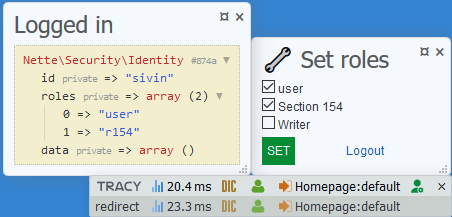

# Role Panel

[](https://packagist.org/packages/sivin/role-panel)
[](https://packagist.org/packages/sivin/role-panel)

Role Panel is an extension for [Nette Framework](https://nette.org) which change user roles in development mode, where it appears in [Tracy](https://tracy.nette.org) debugger bar.

### Installation

1. Install library via composer:

    ```bash
    composer require sivin/role-panel
    ```

2. Update your local configuration (e.g. `config.local.neon`) to register Role Panel to Tracy.

    ```yml
    extensions:
        rolePanel: SiViN\RolePanel\DI\RolePanelExtension

    #optional
    rolePanel:
        roleNames:
            r154: Section 154
            5001: Writer
    ```

### Usage

```yml
services:
    authorizator: MyAuthorizator
```

```php
use Nette\Security\Permission;

class MyAuthorizator extends Permission
{
    public function __construct()
    {
        $this->addRole('user');
        $this->addRole('r154');
        $this->addRole('5001');
    }
}
```

### Screenshot

